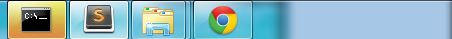

# Blinkr

[](http://www.npmjs.com/package/blinkr)

Blink the window caption and taskbar button to notice that something happend.



_Currently only support Windows_

#### Why use blinkr?

Imaging that you are writting your code in Sublime or Vim, and the gulp/grunt is watching the files, something happend but you didn't know yet, you keep refresh the page, found nothing changed untill then you realized that you need to restart the gulp because there is an error. 

# Install

```bash
npm install blinkr --save
```

## Usage

See `test/test_blink.js`

## License

MIT (http://towry.me/mit-license/)

---

Copyright (c) 2015, Towry Wang
